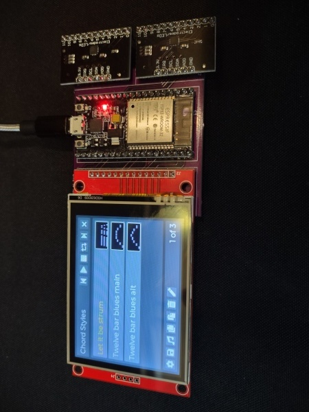
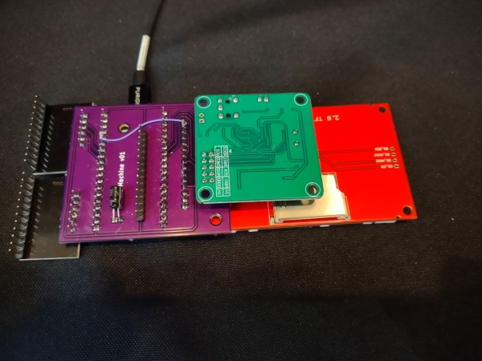
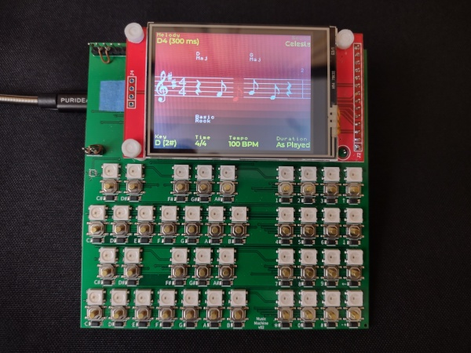
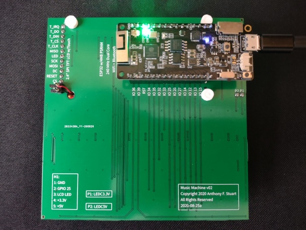
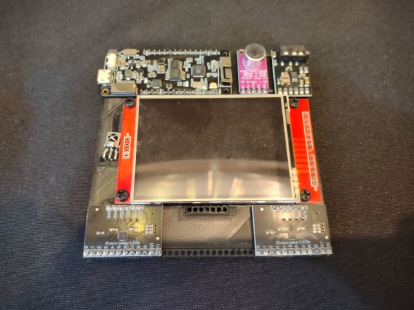
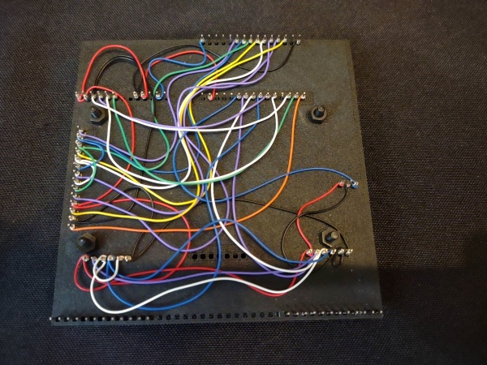
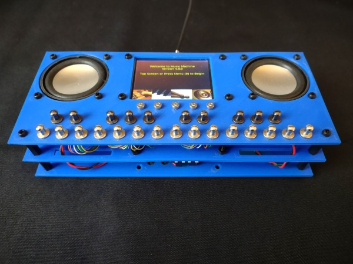
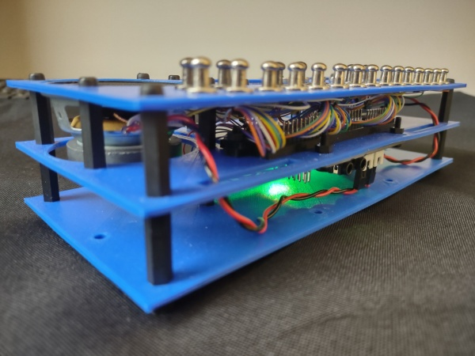
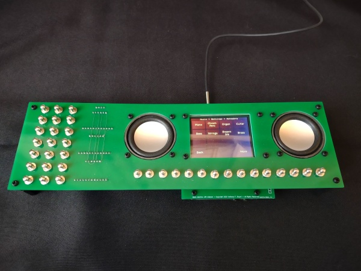
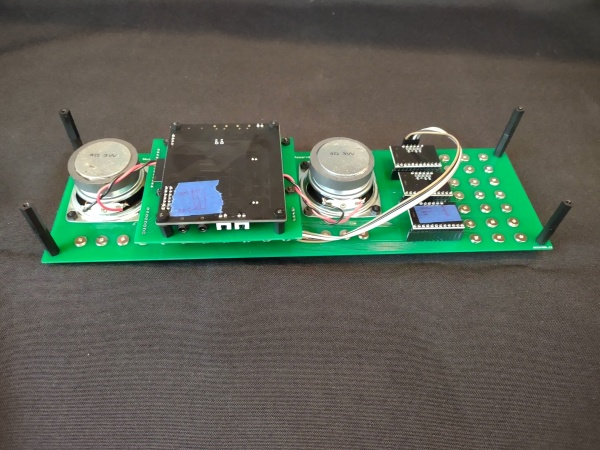

# Overview

Welcome to music-device-lab, an experimental repository that builds on previous music projects, including Music Wheel, Musicianeer, Karaoke Band, Making Music While the Sun Shines and Jamming with Color.

The objective is to create a standalone electronic music instrument that is fun and easy to play. It's not quite there yet, but there are some useful building blocks, including:

* A wavetable synthesizer that evolved from an early MOD player and now contains many of the concepts from the SoundFont specification
* A user interface model and hierarchical touch menu system based on the Lightweight and Versatile Graphics Library (LVGL)
* A music editor that lets you create and edit melodies, chords and rhythms and displays music while you're composing or playing back
* An auto-harp inspired performance mode that lets you strum notes across multiple octaves while constraing the notes to a chord you select
* Support for widely available hardware components, including the 2.4"/2.8" ILI9341 / XPT2046 Color touch LCD display, the vs1053 audio codec, the AiThinker ESP-32 Audio Kit and the MPR121 touch sensor.
* Schematics and printed circuit board (PCB) layouts for a number of devices, including surface mount tactile switches with LEDs as well as capacitive touch sensors
* Reusable component libraries with support for arrays, message buses, CSV files, i2c, i2s, keyboards, LEDs, sequencers and more

# Music Machine v01

Music Machine Version 1 features a 55mm x 58mm PCB that acts as an adapter to integrate a number of common breakout boards, resulting in a useful device that contains an ESP32 microcontroller (with WiFi and Bluetooth), a color LCD touch display, a MIDI synthesizer and 24 capacitive touch inputs.

The common breakout boards are widely available from suppliers such as Amazon, eBay and AliExpress:

* ESP32 WROOM development board with 240 MHz processor, 520 KB RAM, 4 MB Flash, WiFi, Bluetooth and USB (https://www.amazon.com/gp/product/B07QCP2451)
* 2.8" TFT LCD color touch display with 240x320 resolution, SPI interface, ILI9341 display controller and XPT2046 touch controller (https://www.amazon.com/gp/product/B073R7BH1B)
* VS1053 MP3 / MIDI Audio Player / Codec with SPI interface, microphone input, headphone audio output (https://www.amazon.com/gp/product/B07XCN3C7B)
* MPR121 V12 Proximity Capacitive Touch Sensor Modules -- Music Machine v01 uses two (2) of these for a total of 24 touch inputs (https://www.amazon.com/gp/product/B085W85P95)

This board required a few modifications during bring-up that are easy to make:

* Connect a wire between LCD T-IRQ and ESP-32 GPIO13 (PIN 15). This is optional and enables detection of the XPT2046 touch interrupt instead of polling for input.
* Desolder or cut two-pin LINE-IN header on VS1053. This is required due to incorrect pin/hole alignment. These pins may be resoldered on the opposite side, but current firmware doesn't use LINE-IN.
* Cut ADDR trace on second MPR121 and solder or wire to SDA. This changes the I2C address of the second MPR121 from 0x5A to 0x5C so that both MPR121 boards are addressable.

The layout for this PCB was done with KiCad and the board was manufactured by OshPark.

# Music Machine v02

Music Machine Version 2 features a 100mm x 100mm printed circuit board (PCB) with 40 surface mount tactile switches and 40 individually addressable surface mount LEDs.

It uses the smaller 2.4" version of the LCD color touch display and a more powerful ESP32 WROVER development board that includes 8 MB of PSRAM (4 MB directly addressable + 4 MB of bank switched).

The objective for this board was to test a number of new capabilities, including the FluidSynth synthesizer, Bluetooth audio output and surface mount tactile switches.

This resulted in a number of findings:

* The Bluetooth Low Energy (BLE) MIDI synthesizer interface works well, with minimal latency. In this scenario, Music Machine v02 generates BLE MIDI messages for individual notes and sends them to a BLE MIDI synthesizer (e.g. running on a phone).
* Classic Bluetooth streaming audio from Music Machine v02 also works, although there is a noticeable startup delay.
* Classic Bluetooth streaming audio for individual notes does not work, due to significant latency (e.g. 250-500 ms between pressing a key and hearing the note). This is a known problem. Google for Garage Band and Bluetooth.
* Even a really stripped-down version of the FluidSynth synthesizer does not run well in this environment due to memory and CPU resource constraints
* The surface mount tactile switches require a lot of force and are not comfortable to press

Also, the board had a major design issue which wasn't detected until bring-up: the polarity of the LEDs is reversed. Working around this requires:

* Reversing the polarity of the top and bottom planes (top becomes GND, bottom becomes 5V)
	* Swapping the 5V and GND pins between the ESP32 and the board
	* Running new wires from ESP32 to LCD display 5V and GND pins
* Desoldering the 74LVC1T45DW-7 3.3V to 5V level shifter
	* Intended to convert ESP32 3.3V GPIO output to LED 5V input
	* Although it is out of spec, the ESP32 3.3V output can drive the LED 5V input

The Music Machine v02 schematic and PCB layout were updated with correct polarity to produce the Music Machine v03 schematics and layout, but Music Machine v03 was never manufactured or tested because development focus shifted to Music Machine v03.

The PCB layout for Music Machine v02 was done with EasyEDA and the board was manufactured by JLCPCB.

# Music Machine v04

Music Machine v04 uses the ESP32 WROVER board from v03 and adds a 2.8" color LCD touch display, two or three MPR121 capacitive touch controllers, a CS4344 I2S Stereo DAC, a MAX9814 Electret Microphone and a TL1838 Infrared Receiver.

This version is a wire-wrapped one-off prototype. The objective for this board was to explorer alternative audio input and output capabilities, as well as IR remote control via an external keypad.

Key findings include:

* Although bread-boarding, wire-wrapping and PCB design / layout of breakout boards works well for digital circuits, this approach can lead to excessive noise in audio circuits.
* This particular circuit displays significant noise due to ambient 60 cycle hum, as well as transient activity related to CPU and video processing.
* Rather than reinvent an audio system, it makes sense to go with an existing audio board for future development.

# Music Machine v05

Music Machine v05 features a 2.8" color LCD touch display, a touch sensitive keyboard and stereo speakers. It uses the Ai Thinker ESP32 Audio Kit with ESP32-A1S, AC101 audio codec, and I2S amplifiers.

This version is a wire-wrapped one-off prototype. The objective for this board was to experiment with higher volume audio output, new synthesizers and a playable form-factor.

Firmware development for this device included the evolution of a MOD synthesizer to a capable wave-table synthesizer with support for SoundFont presets, instruments, samples and ADSR envelopes.

The ESP32 Audio Kit breakout board was modified to free up GPIOs needed for the display and touch sensors. This required removing R67 for GPIO19, R68 for GPIO23, R69 for GPIO18 and R70 for GPIO05. In addition the switches in the DIP switch should be set OFF to enable GPIO13 and GPIO15 for general use. Plus the MPR121 traces were cut and rewired to produce unique I2C addresses.

Music Machine v05 is really the first playable device developed for this project, but it's still not really easy to play. This led to Music Machine v06.

# Music Machine v06

Music Machine v06 is the latest device. It uses the same basic hardware as Music Machine v05, but does not include a piano-style keyboard layout, opting instead for chord selection on the left and note strumming on the right.

This approach is inspired by the classic auto-harp (which also inspired Suzuki's Omnichord and Q-Chord). The idea is to preselect notes that sound good together (e.g harmonizing, as in a chord) and then allow the user to easily play those notes across multiple octaves. This constraint is similar, in some ways to the "notes in the key of the song" that were the basis for Karaoke Band.

This device consists of two PCBs. One forms the top deck and contains pads for the capacitive touch sensors and cutouts for the LCD, speakers and mounting hardware. The other is an adapter, inspired by Music Machine v01, that connects the LCD and ESP32 Audio Kit together with the MPR121 I2C bus. This results in a significantly simpler build than Music Machine v05.

The PCB layout done with EasyEDA and the boards were manufactured by JLCPCB.

